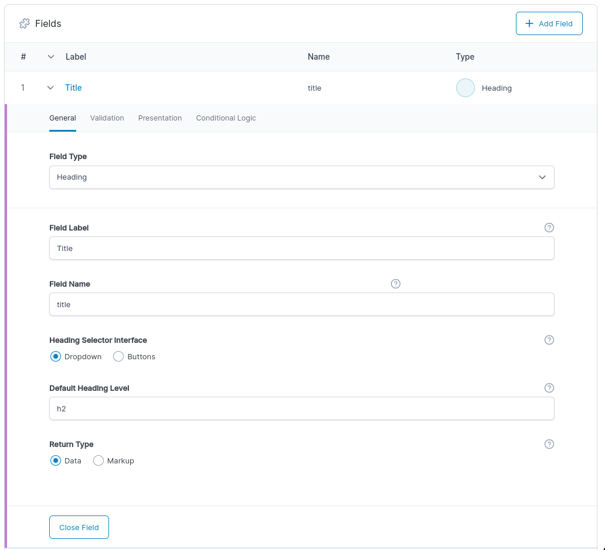

# acf-heading-field

A lean text entry field with selector for HTML heading level for ACF.




Any text that might have SEO value can be given the correct header value from WP Admin.  
Decouple SEO updates from code changes.

## Configuration

Per field:

- Button group or select UI
- Default element
- Return HTML (markup) or data array
- (Optional) CSS class to include with HTML markup return

(see screenshots above).

### Markup

Returns a single HTML element with optional CSS class.

```html
<h1>your text</h1>
```

```html
<h1 class="your-class">your text</h1>
```

(where h1 is the selected heading level.)

### Data

Returns data in an array.

```php
[
  'text' => 'your text',
  'level' => 'h1'
]
```

## Usage

Recommended usage is to select the Data return type and use the get_heading() helper function included with this plugin.

```php
<?php echo get_heading(get_field("title"), "text-center"); ?>
```

The signature is `get_heading( <data array>, <css classes> );`  
This is the cleanest way to keep your classes in your php file at the site of use. Which makes maintenance easier over time.

## Changelog

### v1.0.0

Added default values.  
Initially the default tag is <p>  
This can be overwritten theme-wide and per field.

### v0.9.1

Release candidate for v1.  
Seems to be working fine but hasn't been battle tested.  
Thanks for submitting any issues that you come across.
