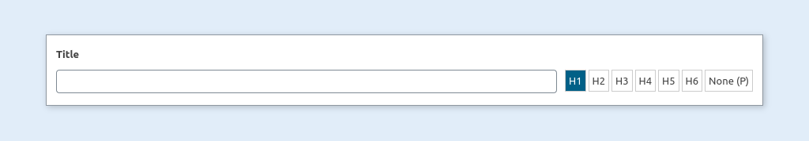
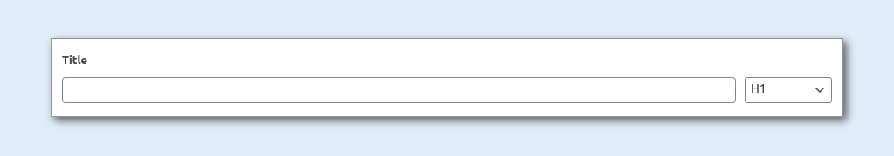

# acf-heading-field

A lean text entry field with selector for HTML heading level for ACF.  

  

  


Allows frontend users to make SEO decisions about heading levels.

## Interface Settings

Available options buttons or select (see screenshots above).

## Output / Return

Returns plain data or markup with optional CSS class.

### Markup

Returns a single HTML element with optional CSS class. 
```html
<h1>your text</h1>
```
```html
<h1 class='your-class'>your text</h1>
```
(where h1 is the selected heading level.)

### Data
Returns data in an array.
```php
[ 
  'text' => 'your text',
  'level' => 'h1'
]
```

NOTE: no class data - CSS class optional is conditional on using the Markup return.  
If you're grabbing the data you can handle classes yourself in code.

## Installation

This add-on can be treated as both a WP plugin and a theme include.

**Install as Plugin**

1. Copy the 'acf-heading-field' folder into your plugins folder.
2. Activate the plugin via the Plugins admin page.

**Include within theme**

1.  Copy the 'acf-heading-field' folder into your theme folder (can use sub folders).
2.  Edit your functions.php file and add the code below (Make sure the path is correct to include the acf-heading-field.php file).

```php
include_once('acf-heading-field/acf-heading-field.php');
```

## v0.9.1
Release candidate for v1.  
Seems to be working fine but hasn't been battle tested.  
Thanks for submitting any issues that you come across.
